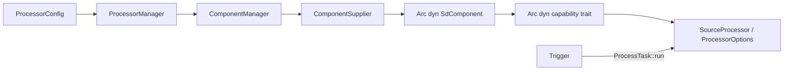

# Agent 需求入口指南

本文用于帮助后续 Agent 按需求快速定位代码入口。先建立一个核心认识：

> 本项目以 `Component` 表达可替换能力，以 `ProcessorConfig` 描述能力组合，
> `ProcessorManager` 负责解析配置和装配依赖，`SourceProcessor` 负责执行一个
> `SourceItem` 从获取、过滤、解析文件、生成目标路径、下载到持久化的完整流程。

`SourceProcessor` 当前确实接近一个 God class。修改单个能力时应优先进入对应
Component；只有修改跨阶段编排、状态转换或生命周期时才进入 `source_processor.rs`。

## 1. 最短阅读路径

按以下顺序阅读即可建立完整心智模型：

1. `source-downloader-sdk/src/lib.rs`
   - 领域输入 `SourceItem`。
2. `source-downloader-sdk/src/component.rs`
   - `ComponentRootType`、`ComponentType`、`ComponentId`。
   - `ComponentSupplier`、`SdComponent` 和全部能力 trait。
3. `source-downloader-core/src/config.rs`
   - `ComponentConfig`、`ProcessorConfig`、`ProcessorOptionConfig`。
4. `source-downloader-core/src/component_manager.rs`
   - Supplier 注册、Component 懒创建、实例共享和引用记录。
5. `source-downloader-core/src/processor_manager.rs`
   - 配置引用如何变成 trait object，并装配成 `SourceProcessor`。
6. `source-downloader-core/src/source_processor.rs`
   - `SourceItem` 全流程和处理状态转换。
7. `source-downloader-core/src/application.rs`
   - 启动、注册、创建 Processor、启动 Trigger 的顺序。
8. `applications/web/src/main.rs`
   - 可执行程序、存储实现、Core 和 HTTP Router 的最终装配入口。

## 2. 架构分层

| 层 | 目录/文件 | 职责 |
|---|---|---|
| 契约与领域模型 | `source-downloader-sdk` | Component trait、`SourceItem`、处理状态、存储和插件契约 |
| 派生宏 | `component-macro` | 根据 `#[component(...)]` 生成 `SdComponent::as_*` 转换 |
| 编排与生命周期 | `source-downloader-core` | 配置、Component/Processor 管理、完整处理流程 |
| 内建能力 | `source-downloader-core/src/components` | Trigger、Downloader、文件系统能力和表达式过滤器 |
| 插件能力 | `plugins/common` | 通过 `Plugin::get_component_suppliers` 提供额外 Component |
| 持久化适配器 | `storage-sqlite`、`storage-memory` | 实现 SDK 的 `ProcessingStorage` |
| HTTP/进程入口 | `applications/web` | Axum API、配置路径、数据库和 CoreApplication 装配 |

依赖方向应保持：Web/Storage/Plugin → Core/SDK，Core → SDK。不要把 HTTP 类型放进
Core，也不要把 SeaORM 类型暴露到 SDK。

## 3. Component 模型

### 3.1 三个不同概念

定义位于 `source-downloader-sdk/src/component.rs`：

- `ComponentRootType`：能力大类，例如 `Source`、`Downloader`、
  `ItemFileResolver`、`SourceItemFilter`。
- `ComponentType`：能力大类与具体实现名，例如 `(Downloader, "http")`。
- `ComponentId`：具体配置实例，例如 `(Downloader, "http", "default")`。

Processor 配置中的引用通常省略 root type，因为字段已经限定能力类型：

```yaml
source: mikan
item-file-resolver: system-file:test
downloader: http
file-mover: system-file
triggers:
  - fixed:10s
```

`ComponentRootType::parse_component_id` 按 `type[:instance]` 解析：

- `mikan` → type=`mikan`，instance=`mikan`；
- `fixed:10s` → type=`fixed`，instance=`10s`。

完整的 `ComponentId::parse` 用于包含 root type 的场景，格式为
`root-type:type[:instance]`。不要混淆这两种解析入口。

### 3.2 能力类型

`ComponentRootType` 与同文件 trait 是能力清单：

| 能力 | 核心方法 | 所处阶段 |
|---|---|---|
| `Trigger` | `add_task`、`start` | 触发整个 Processor |
| `Source` | `fetch`、pointer 读写 | 获取 `SourceItem` |
| `ItemFileResolver` | `resolve_files` | 将 Item 展开为 `SourceFile` |
| `Downloader` / `AsyncDownloader` | `submit` / `is_finished` | 下载或提交异步下载任务 |
| `FileMover` | `exists`、`move_file`、`replace` | 文件存在检查、移动和替换 |
| `SourceItemFilter` | `filter` | Item 早期过滤 |
| `SourceFileFilter` | `filter` | Resolver 结果过滤 |
| `VariableProvider` | item/file variables | 文件命名变量生成 |
| `FileTagger` | `tag` | 给 `SourceFile` 增加标签 |
| `FileContentFilter` | `filter` | 目标路径生成后的单文件过滤 |
| `ItemContentFilter` | `filter` | Item 文件集合生成后的过滤 |
| `FileExistsDetector` | `exists` | 扩展目标文件存在判断 |
| `ProcessListener` | success/error/completed | 处理生命周期回调契约 |

`FileReplacementDecider`、`VariableReplacer`、`Trimmer` 也已定义在 SDK，但当前主流程
没有完整接入。新增逻辑前先确认调用点，而不是只看到 trait 就假设它已生效。

### 3.3 Component 如何创建和共享

关键入口：`source-downloader-core/src/component_manager.rs`。

1. `ComponentManager::register_supplier` 按 `ComponentType` 注册 Supplier。
2. `ComponentManager::get_component` 首次访问时：
   - 找到 Supplier；
   - 从 `ConfigOperator` 获取对应 `ComponentConfig.props`；
   - 调用 `ComponentSupplier::apply`；
   - 缓存 `ComponentWrapper`。
3. 一个 Supplier 可以返回多个 `ComponentType`。这些类型共享同一个
   `Arc<dyn SdComponent>`，但各自有一个 `ComponentWrapper`。
4. `ComponentWrapper::require_component` 将创建失败统一转成 `ComponentError`。
5. Trigger 使用 `get_and_mark_ref` 记录 Processor 引用；删除 Processor 时由
   `ProcessorManager::destroy_processor` 从 Trigger 中移除任务。

因此 Component 是**按配置名称懒创建并缓存的共享实例**，不是每个 Processor 一份。
修改有内部状态的 Component 时必须考虑多个 Processor 共享和并发调用。

### 3.4 新增现有能力的实现

参考：

- 内建简单实现：
  `source-downloader-core/src/components/system_file_source.rs`；
- 插件实现：`plugins/common/src/component/mikan_source.rs`；
- 宏实现：`component-macro/src/lib.rs`。

实现步骤：

1. 定义 Supplier，实现 `ComponentSupplier`：
   - `supply_types` 声明具体 `ComponentType`；
   - `apply` 从 JSON props 创建实例；
   - 如无配置也可创建，覆写 `is_support_no_props`；
   - UI 需要表单时通过 `get_metadata` 返回 schema。
2. Component 实现目标能力 trait 和 `Display`/`Debug`。
3. 添加：

   ```rust
   #[derive(SdComponent, Debug)]
   #[component(Source)]
   ```

   宏会生成对应 `SdComponent::as_source`。一个实例提供多种能力时可写
   `#[component(Source, ItemFileResolver, Stateful)]`。
4. 注册 Supplier：
   - 内建能力加入 `source-downloader-core/src/components/mod.rs` 的
     `get_build_in_component_supplier`；
   - 插件能力加入对应 `Plugin::get_component_suppliers`，例如
     `plugins/common/src/lib.rs`。
5. 增加 `components.<root-type>` 下的配置实例，并由 Processor 字段引用。

如果新增的是一种全新的能力大类，而不是现有 trait 的实现，还必须同步修改：

- SDK：`ComponentRootType` 的枚举、parse/name、`ComponentType` 构造器、
  `SdComponent::as_*` 和新 trait；
- `component-macro` 是否能生成对应转换；
- Core：`ProcessorOptionConfig`、`ProcessorManager::create_options` 或
  `create_internal`；
- `SourceProcessor` 的持有字段和实际调用阶段；
- Web 的类型/schema 输出（如需要对外暴露）。

这是高影响变更，不应只添加一个 trait。

## 4. Processor 如何引用和管理 Component

配置模型位于 `source-downloader-core/src/config.rs`。

`ProcessorConfig` 的四个必需执行能力为：

- `source`；
- `item-file-resolver`；
- `downloader`；
- `file-mover`。

`triggers` 控制何时执行。过滤器、变量提供器、Tagger、Listener、存在检测器、
规则和下载选项位于 `ProcessorOptionConfig`。

装配入口位于 `source-downloader-core/src/processor_manager.rs`：

- `create_processor`：处理 enabled、错误包装和任务注册；
- `create_internal`：解析四个必需 Component，并调用 `SourceProcessor::new`；
- `create_options`：解析可选 Component、表达式和 item/file rules，生成
  `ProcessorOptions`；
- `register_task`：将 `Arc<SourceProcessor>` 作为 `Arc<dyn ProcessTask>` 加入 Trigger；
- `destroy_processor`：解除 Trigger 中的任务引用。

装配链为：



修改“配置字段如何映射到运行时对象”时，入口应是 `ProcessorManager`，而不是
`SourceProcessor`。修改“对象已经装配好以后如何协作”时，入口才是
`SourceProcessor`。

## 5. SourceItem 全流程

主入口：`source-downloader-core/src/source_processor.rs`。

调用链：

```text
Trigger
  -> ProcessTask::run
  -> NormalProcess::execute
  -> Source::fetch
  -> 对每个 PointedItem 调用 Process::process_item
  -> NormalProcess 收尾并保存 SourcePointer / ProcessingContent
```

### 5.1 一次 Processor 执行

`Process::execute`：

1. 用 `AtomicBool` 拒绝同一 Processor 重入。
2. 从 `ProcessingStorage` 读取 `ProcessorSourceState`。
3. 通过 `Source::parse_raw_pointer` 恢复 pointer。
4. 对 `Source::fetch` 使用最多三次指数退避，仅重试 `Retryable` 错误。
5. 顺序处理返回的 `PointedItem`。
6. 成功后更新 `SourcePointer`；根据 `pointer_batch_mode` 逐 Item 或批量持久化。

### 5.2 单个 SourceItem

`Process::process_item` 当前顺序：

1. 按 `SourceItem::hashing` 做本批次去重。
2. 匹配 `ItemRule`，选择规则级或 Processor 级 `SourceItemFilter`。
3. 执行 Item 过滤。
4. 运行 `VariableProvider::item_variables` 并聚合变量。
5. `resolve_files`：
   - `ItemFileResolver::resolve_files`；
   - `SourceFileFilter`；
   - 检查同一 Item 内重复路径；
   - `FileTagger`。
6. `process_source_files`：
   - 生成 file variables；
   - 匹配 `FileRule`；
   - 选择 save path/filename pattern；
   - `Renamer::create_file_content` 生成 `FileContent`；
   - `FileContentFilter`。
7. 执行 `ItemContentFilter`。
8. `update_file_content_status`：变量错误、目标冲突、目标已存在、正常。
9. `probe_content_status` 决定是否下载。
10. `do_download`：
    - 带内存数据的文件直接写盘；
    - 其余文件合并 Source/Processor headers 后提交给 `Downloader`。
11. 同步 Downloader 分支尝试 movement/replacement，并形成 `ProcessingContent`。
12. `NormalProcess::on_item_process_complete` 按配置保存处理记录和压缩后的
    `FileContent`。
13. `NormalProcess::on_item_success` 更新并保存 Source pointer。

路径和重命名计算不全在 God class 内：

- `source-downloader-core/src/process/file.rs`
  - `PathPattern`、`Renamer`、`RawFileContent`；
- `source-downloader-core/src/process/rule.rs`
  - Item/File matcher 与 strategy；
- `source-downloader-core/src/process/variable.rs`
  - 变量冲突策略和聚合；
- `source-downloader-core/src/expression.rs`、`expression/cel.rs`
  - 表达式编译和执行。

## 6. 按需求找入口

| 需求 | 第一入口 | 通常还要检查 |
|---|---|---|
| 新增 Source/Downloader/Filter 等实现 | 对应 `components/*.rs` 或插件组件 | SDK trait、Supplier 注册、配置示例 |
| 新增 Component 能力大类 | `source-downloader-sdk/src/component.rs` | 宏、配置、ProcessorManager、SourceProcessor、Web |
| 修改 Component props 或实例查找 | `config.rs`、`component_manager.rs` | Web component API、现有 config.yaml |
| 修改 Processor 必需依赖 | `processor_manager.rs::create_internal` | `ProcessorConfig`、`SourceProcessor::new` |
| 修改可选过滤器/变量/规则装配 | `processor_manager.rs::create_options` | `ProcessorOptionConfig`、process/rule/variable |
| 修改 SourceItem 阶段顺序或状态机 | `source_processor.rs::process_item` | `ProcessingStatus`、存储内容、指针推进 |
| 修改整次抓取/重试/并发防重入 | `source_processor.rs::execute` | `ProcessingError`、Source pointer、Trigger |
| 修改文件解析 | `source_processor.rs::resolve_files` | `ItemFileResolver`、`SourceFileFilter`、Tagger |
| 修改目标路径和文件名 | `process/file.rs` | `process_source_files`、规则和变量聚合 |
| 修改是否下载/覆盖/已存在判断 | `probe_content_status`、`update_file_content_status` | `FileMover`、`FileExistsDetector` |
| 修改下载请求 | `source_processor.rs::do_download` | `Downloader`、`HttpDownloader`、Source headers |
| 修改定时和手动触发 | `fixed_schedule_trigger.rs`、`register_task` | `ProcessTask`、Web `trigger_processor` |
| 修改处理记录或 pointer 持久化 | SDK `storage.rs` | `NormalProcess` 收尾、`storage-sqlite` |
| 修改启动顺序/插件注册 | `application.rs::CoreApplication::start` | Web `main.rs`、PluginManager |
| 新增/修改 HTTP API | `applications/web/src/service/*.rs` | `ApplicationContext`、Core manager、AppError |
| 修改数据库表 | `storage-sqlite/src/lib.rs` | `storage-sqlite/migrations/sqlite`、SDK storage trait |

## 7. 启动和外部入口

进程入口为 `applications/web/src/main.rs::main`：

1. 初始化日志和 CLI 配置；
2. 创建 `SeaProcessingStorage`；
3. 创建 `YamlConfigOperator`、各 Manager 和 `CoreApplication`；
4. 注册 `plugins/common`；
5. 调用 `CoreApplication::start`；
6. 合并 Axum routes 并启动服务器。

`CoreApplication::start` 的固定顺序是：

```text
加载外部插件
  -> 注册 InstanceFactory
  -> 注册内建/插件 ComponentSupplier
  -> 根据全部 ProcessorConfig 创建 Processor
  -> 启动已实例化的 Trigger
```

HTTP 入口：

- Component：`applications/web/src/service/component.rs`；
- Processor：`applications/web/src/service/processor.rs`；
- Processing records：`applications/web/src/service/processing.rs`；
- 应用控制：`applications/web/src/service/app.rs`；
- 路径相关：`applications/web/src/service/path.rs`。

## 8. 持久化入口

契约位于 `source-downloader-sdk/src/storage.rs::ProcessingStorage`，主要保存：

- `ProcessingContent`；
- 压缩后的 `FileContent`；
- `ProcessorSourceState`；
- `ProcessingTargetPath`。

SQLite 实现位于 `storage-sqlite/src/lib.rs::SeaProcessingStorage`，迁移位于
`storage-sqlite/migrations/sqlite`。主流程通过 trait object 注入存储，不应直接依赖
SQLite。

## 9. 当前实现边界和风险点

后续 Agent 必须先确认这些现状，避免把“已定义”误认为“已实现”：

- `SourceProcessor::dry_run`、`reprocess` 尚未实现实际流程。
- `Process::do_movement` 和 `do_replacement` 当前是空实现。
- `ProcessListener` 已装配进 `ProcessorOptions`，但主流程回调仍有 TODO。
- Processor HTTP API 中 get/query/dry-run/rename/items/state/pointer/contents 等多个
  handler 仍为 `todo!()`；`trigger_processor`、create/update/delete/reload 已有实现。
- `storage-sqlite` 的 `find_by_name_and_hash`、`save_paths` 仍为 `todo!()`。
- `storage-memory` 在仓库说明中明确为不完整实现。
- `ComponentRootType`、trait、Processor option 和主流程之间是手工同步关系；新增能力时
  编译通过不代表运行时已接入。
- Component 实例可能被多个 Processor 共享；内部可变状态必须线程安全。
- Source pointer 的推进决定重复抓取和丢数据风险。调整过滤、错误中断或持久化时，必须
  同时审查 `on_item_success` 和 `on_process_complete`。

## 10. 修改后的最小验证

按改动层级选择验证，不要只做编译检查：

- Component 实现：运行该 Component 所在 crate 的精确测试，再用包含它的
  Processor 配置触发一次真实处理。
- Processor 装配：运行 `source-downloader-core` 对应测试，并确认配置能创建
  `ProcessorWrapper.processor = Some(...)`。
- SourceItem 流程：优先使用
  `source-downloader-core/src/source_processor.rs` 内联测试和
  `source-downloader-core/src/processor_test_support.rs`，验证过滤、状态、下载与 pointer。
- SQLite：使用 `sqlite::memory:` 运行 `storage-sqlite` 精确测试。
- Web API：启动 `cargo run -p web --bin web`，请求实际路由并检查状态码与副作用。
- 跨 SDK 公共契约：最后运行受影响 crate，再运行 `cargo check --workspace`。

Agent 在动手前应回答三个问题：

1. 这是“新增/修改一个能力”，还是“改变多个能力的编排”？
2. 配置引用在 `ProcessorManager` 的哪个位置被解析为 trait object？
3. 变化会不会影响处理状态、Source pointer 或持久化内容？

能明确这三个问题，通常就能找到正确入口并避免继续加深 `SourceProcessor` 的 God class
职责。
